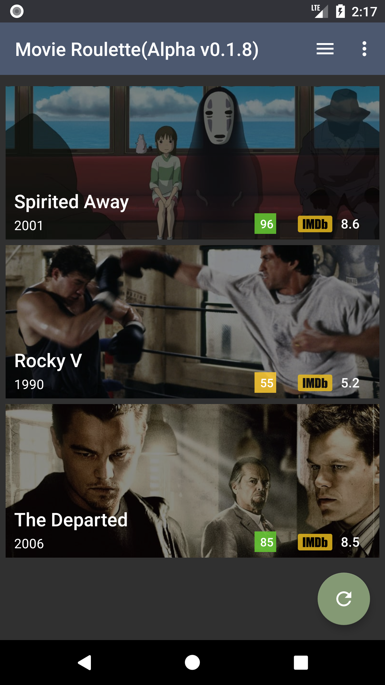
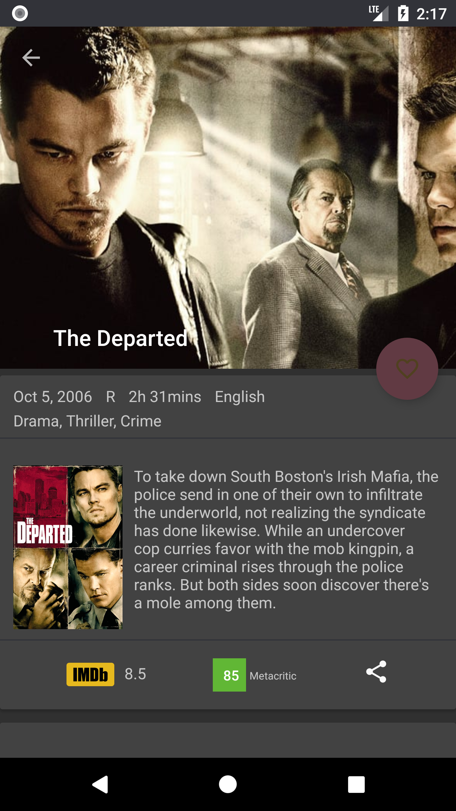
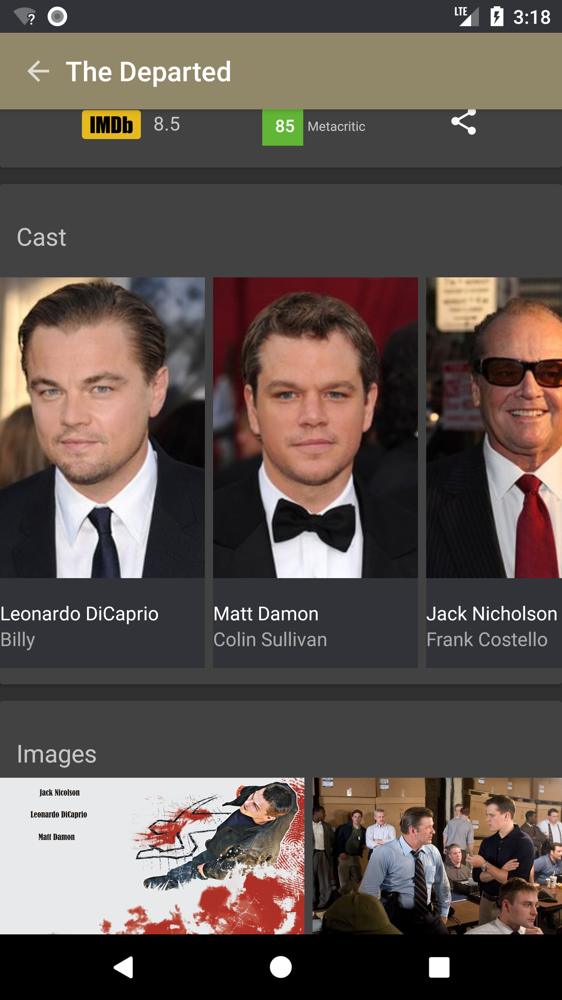

# Movie Roulette

A **work-in-progress** Android app for discovering new movies to watch.

**[Install on Google Play (alpha testing)](https://play.google.com/store/apps/details?id=com.jdhdev.mm8)**

 |  | 

## Developement
Movie Roulette app is built using a combination of well established mixed with the latest cutting edge tools and libraries. In a brief summary:
* Written partly in Java and partly in Kotlin
* uses [RxJava 2](https://github.com/ReactiveX/RxJava)
* uses [Room](https://developer.android.com/topic/libraries/architecture/room.html)
* uses [Dagger 2](https://google.github.io/dagger/)
* uses [Retrofit 2](http://square.github.io/retrofit/)
* follows the MVP architecture
